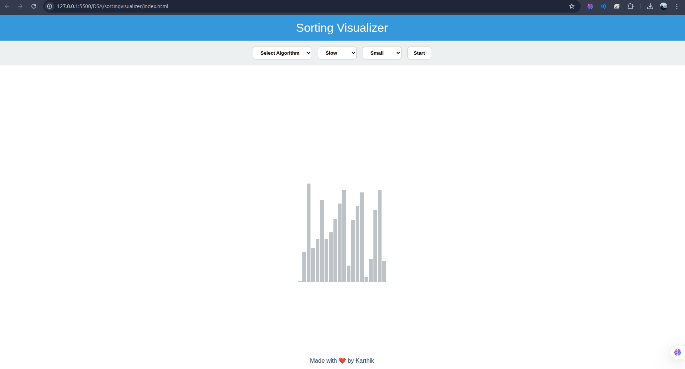

# Sorting Visualizer 🔢✨

An interactive web-based Sorting Algorithm Visualizer built with **HTML**, **CSS**, and **JavaScript**. Watch your favorite sorting algorithms come to life with dynamic animations and full control over speed and size.

## 🚀 Live Demo
🔗 [Click here for live Demo](https://karthik6132.github.io/SortingVisualizer/)

---

## 🧠 Features

- 🎨 Sleek, modern UI
- 📊 Animated visual feedback for each step
- 🔁 Adjustable speed and array size
- 📚 Algorithms included:
  - ✅ Bubble Sort
  - ✅ Selection Sort
  - ✅ Insertion Sort
  - ✅ Merge Sort
  - ✅ Quick Sort

---

## 📁 Project Structure

SortingVisualizer/
├── index.html
├── css/
│ └── style.css
├── scripts/
│ ├── app.js
│ ├── helper.js
│ └── sort.js

## 💡 How to Use

1. Select a sorting algorithm.
2. Choose the array size and speed.
3. Click **Generate Array** to create a new random array.
4. Hit **Start Sorting** to see the magic.

---

## 🌐 Built With

- HTML5
- CSS3 (with modern variables and layout)
- Vanilla JavaScript (ES6+)
- GitHub Pages

---

## 👨‍💻 Author

Created by **Karthik Palam**  
🔗 [GitHub](https://github.com/karthik6132)
